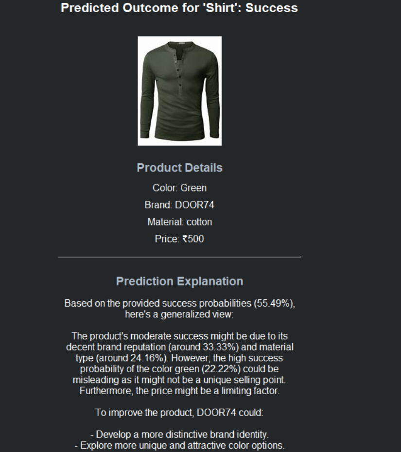

# Myntra Women Wear Analysis 👗📊

## 📌 Overview
This project analyzes **Myntra Women’s Wear dataset** to predict whether a product will be a **boon (successful)** or **loss (unsuccessful)** in the market.  

The workflow is **semi-supervised**:  
- First, we use **K-Means clustering** to automatically label products based on **rating, rating count, and price**.  
- Then, we train a **Machine Learning ensemble model (Logistic Regression + Random Forest)** to predict product success for unseen data.  
- Finally, we use **Groq API (LLM-powered)** to provide **natural language explanations** on why a product may not succeed.

---

## 🎯 Objectives
- Create labels (boon / loss) using clustering.  
- Predict product success with high accuracy.  
- Provide interpretable insights using Logistic Regression.  
- Capture complex feature interactions with Random Forest.  
- Generate **user-friendly suggestions** with Groq API.  

---

## ⚙️ Methodology

### 1. Data Labeling (K-Means Clustering)
- Dataset originally lacked labels.  
- Applied **K-Means clustering** on:  
  - `rating`  
  - `rating count`  
  - `price`  
- Interpreted clusters as:  
  - **Boon** → High rating, high review count, reasonable price.  
  - **Not Boon** → Low rating, few reviews, extreme pricing.  

### 2. Preprocessing
- Missing value handling.  
- Encoding categorical variables (brand, material, category).  
- Scaling numerical features (price, ratings).  

### 3. Predictive Modeling
- **Logistic Regression** → interpretable feature importance.  
- **Random Forest** → robust, captures non-linear patterns.  
- **Ensemble Model** → combines both for better performance.  

### 4. Explanation Layer (Groq API)
- Predictions are paired with **natural-language insights**.  
- Example:  
  - *Prediction*: Product = Not Boon  
  - *Explanation*: “This product is unlikely to succeed because the rating is below 3 and the price is higher than most products in its category.” 

---

## 📊 Results
- Ensemble model improved prediction accuracy compared to individual models.  
- Logistic Regression highlighted key drivers (price, rating, brand).  
- Random Forest captured hidden interactions between product attributes.  
- Groq API made predictions **interpretable and user-friendly**.  

---

## 🖼️ Visualizations

### Brand vs Rating Distribution


### Brand-specific Success


### Tkinter Prediction App (GUI)


### Prediction result (GUI)



---

## 🖥️ How to Run

1. **Clone Repo**
   ```bash
   git clone https://github.com/yourusername/Myntra-Women-Wear-Analysis.git
   cd Myntra-Women-Wear-Analysis

